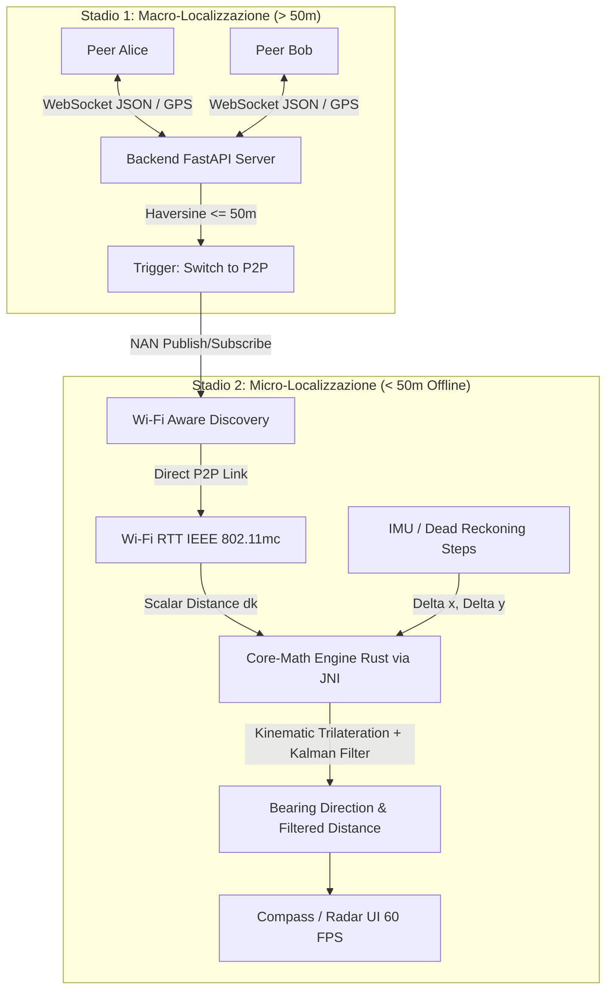

# CrowdPulse (PitPoint) 🛰️📍

> **Off-grid, dual-stage mutual localization system for ultra-dense & extreme environments (festivals, concerts, emergency scenarios).**

---

## 🏗️ Architettura del Sistema a Due Stadi



### 1. Stadio 1: Macro-Localizzazione (Distanza > 50m)
- Coordinate GPS / Fused Location scambiate su canale WebSocket leggero.
- Il server gestisce stanze da massimo 2 peer, calcola costantemente la distanza geodetica con la formula di **Haversine**.
- Al superamento della soglia dei **50 metri**, il server emette l'evento `switch_p2p` con assegnazione deterministica dei ruoli NAN (*publisher* / *subscriber*).

### 2. Stadio 2: Micro-Localizzazione ad Alta Precisione (Distanza < 50m - Offline P2P)
- Discovery e peering radio diretto offline via **Wi-Fi Aware (NAN)** senza passare per internet o celle telefoniche.
- Misura del tempo di volo metrica via **Wi-Fi RTT (IEEE 802.11mc)** a 5-10 Hz.
- Risoluzione dell'ambiguità angolare polare ($180^\circ$) tramite **Trilaterazione Cinematica**: correlando lo storico dei passi $(\Delta x_k, \Delta y_k)$ dall'IMU con le variazioni scalari $d_k$ di RTT.
- **Filtro di Kalman Esteso 2D (EKF)** per la sensor fusion ad alta frequenza e rendering a 60 FPS della freccia direzionale.

---

## 📂 Struttura del Monorepo

```text
CrowdPulse/
├── server/                     # Backend FastAPI & WebSocket Hub
│   ├── app/
│   │   ├── main.py             # Entrypoint FastAPI & routing WebSocket
│   │   ├── manager.py          # ConnectionManager, Room state & Haversine triggers
│   │   └── schemas.py          # Modelli Pydantic per i payload di scambio
│   ├── tests/
│   │   ├── test_manager.py     # Suite unit test per stanze, limiti e trigger 50m
│   │   ├── client_sender.py    # Simulatore Client A in avvicinamento
│   │   └── client_receiver.py  # Simulatore Client B in ricezione
│   └── requirements.txt
│
├── core-math/                  # Motore Matematico Rust (JNI & C-FFI)
│   ├── Cargo.toml
│   └── src/
│       ├── lib.rs              # Bridge JNI & C exports (CrowdPulseTracker)
│       ├── kinematics.rs       # Algoritmo di Trilaterazione Cinematica
│       └── kalman.rs           # Filtro di Kalman Esteso 2D per Sensor Fusion
│
└── mobile/                     # Frontend React Native & Kotlin Android
    ├── package.json
    ├── tsconfig.json
    ├── src/
    │   ├── App.tsx             # Root & State Machine controller
    │   ├── types/              # Definizioni TypeScript
    │   ├── native/             # Bridge NativeModules
    │   └── components/         # RadarCompass, MacroMap, RoomSelector
    └── android/
        └── app/src/main/java/com/crowdpulse/
            ├── CrowdPulseModule.kt
            ├── nativebridge/   # NativeMathEngine JNI wrapper & fallback
            ├── wifi/           # WifiAwareController & WifiRttController
            ├── sensors/        # ImuStepTracker & Step Integrator
            └── websocket/      # OkHttp WebSocket client
```

---

## 🚀 Guida all'Avvio e Test

### 1. Avviare il Server Backend

```bash
cd server
python3 -m venv .venv
source .venv/bin/activate
pip install -r requirements.txt

# Avviare il server con Uvicorn
uvicorn app.main:app --host 0.0.0.0 --port 8000 --reload
```

### 2. Eseguire la Test Suite

```bash
PYTHONPATH=server server/.venv/bin/python3 -m pytest server/tests
```

### 3. Simulare l'Avvicinamento tra Due Peer (Macro -> Switch P2P)

Nel terminale 1:
```bash
server/.venv/bin/python3 server/tests/client_receiver.py
```

Nel terminale 2:
```bash
server/.venv/bin/python3 server/tests/client_sender.py
```
*I due client scambieranno coordinate simulate. Non appena la distanza scende sotto i 50 metri, entrambi riceveranno l'evento `switch_p2p` per passare a Wi-Fi Aware!*
